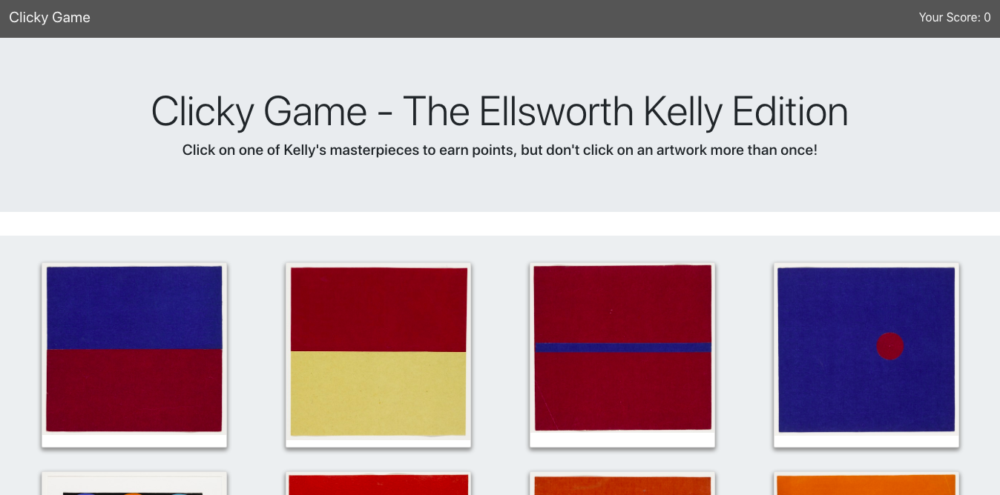

# Ellsworth Kelly Clicky-Game
A simple memory game built with React.

[View the app here]()

## Motivation
I created this game in order to gain experience with React.

## How it Works
First, click on any image/artwork on the page. You will notice that the images shuffle on the page.

Click on a different image, and try to click on all twelve images only once. If you succeed, you win the game (hooray)! If you happen to select an image twice, you automatically lose! 

Good luck and enjoy taking in these beautiful works of color and form by Ellsworth Kelly. 

## Process
In creating this game, I first separated it out into several components (Navbar, Jumbotron, Wrapper, Card, and Footer). These components are all visual aspects of the game, but I might specify different functional components if I edit this game in the future. 

I then created a json file that included an array of objects of all of my image. In each object, I specify a unique id and link to the image.

Then, I imported all components and the array into the App.js file. This is where a lot of the magic happens! I created a class called App and set the state of the class. A component's state is basically an object that determines how that component renders & behaves. After this, I created a method that tells the component how to behave (i.e. what happens when a user clicks on the image). I had to look up a function that would shuffle through the array of artworks. The images shuffle when a user clicks on an image, and the id of the clicked image is also stored in an empty array. If an id of an image appears in the new array more than once, then the game (or the state) resets. 

I created a lot of files for this project, and I'd say some of the most important parts regarding functionality occur in the App.js file and the Card.js file. 

After the game was functioning correctly, I styled the components using separate css files. I created a styles folder that holds all of these files, and I imported the corresponding css file in each component js file.

## Technology Used
* React
* Bootstrap

### Portfolio 
**If you'd like to see more of my work, check out my portfolio [here](https://rocky-refuge-62195.herokuapp.com/#)
